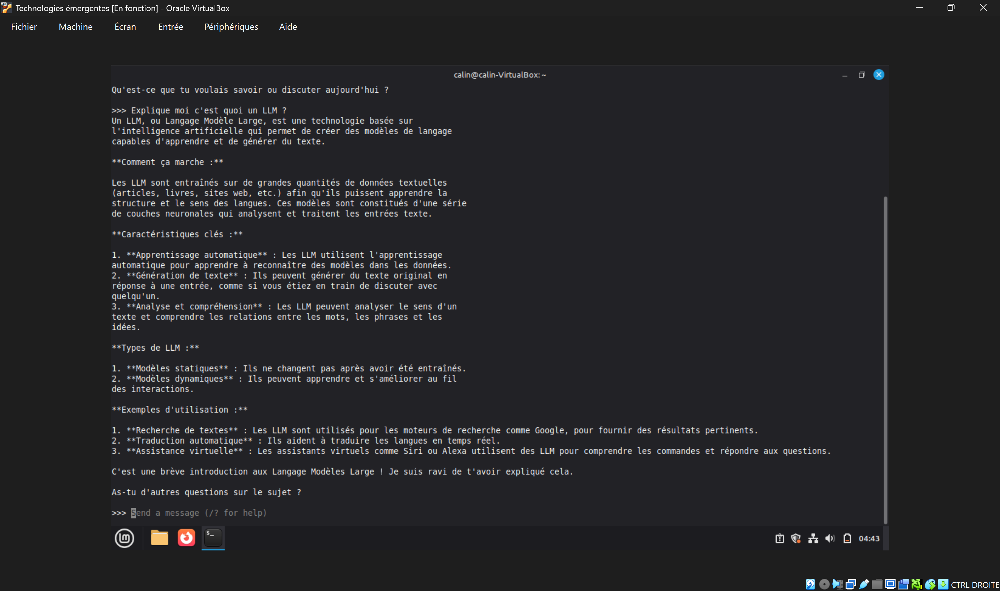
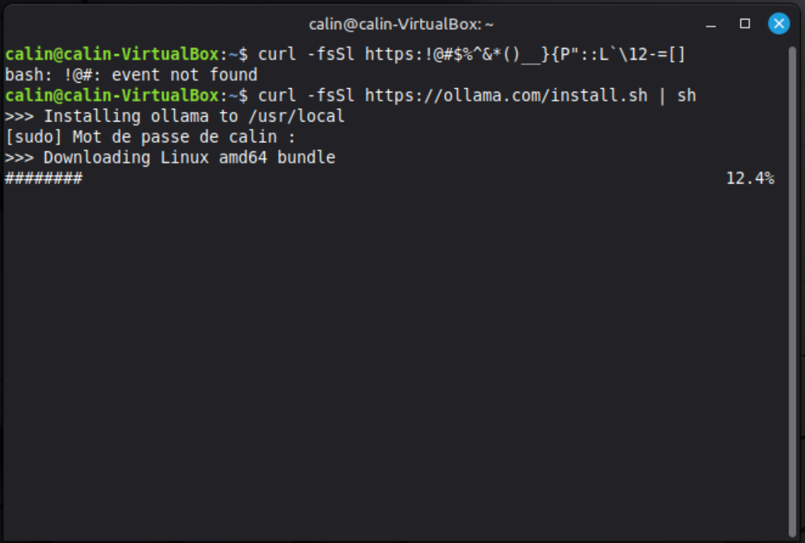
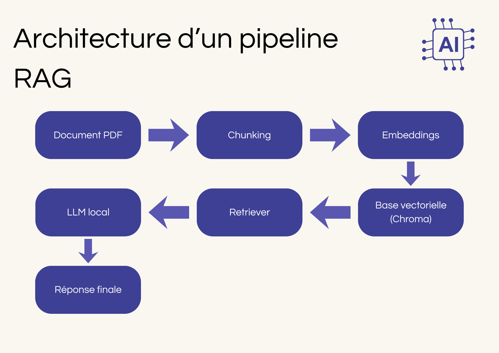

+++
title = "Notes de cours"
weight = 2
+++

## Introduction

Dans ce chapitre, nous allons apprendre, explorer et tester trois technologies modernes qui pourraient nous aider à développer des systèmes très utiles à chaque jour. 

Nous allons parler de ces différents sujets : 
- **Les modèles de langage locaux (LLM locaux)**, alternatifs à ChatGpt et autres, qu’on peut utiliser sur notre ordinateur localement et sans connexion internet.
- **Ollama**, un moteur simple qui permet d’exécuter localement des LLM.
- **Retrieval-Augmented Generation (RAG)**, qui est une méthode qui permet au LLM de recevoir des documents externes pour les analyser et ensuite pouvoir répondre de manière plus précise. 

À la fin de ce chapitre, vous aurez des meilleures connaissances sur les éléments que je viens de citer juste au dessus.

## Qu’est-ce qu’un LLM local ?

Un LLM local (Large Language Model) est un programme d’intelligence artificielle, qui permet de reconnaître et de gérer du texte. 

Pour en arriver là, le LLM a été entraîné sur des quantités immenses de données pour pouvoir répondre à tout type de questions. 

Cette phase d’apprentissage avancé, permet à cette intelligence de faire différentes choses comme : 

- **Comprendre le langage de l’être humain**
- **Prédire la suite d’une phrase grâce à ses statistiques.**
- **Répondre à des questions qu’on lui pose.**
- **Et beaucoup d’autres choses.**

La différence entre un LLM local et un qui est hébergé, c’est premièrement que les LLM locaux sont exécutés sur ton propre ordinateur ce qui veux dire, qu’on peut l’utiliser sans connexion internet et c’est ce qui rend la chose encore plus intéressante en termes de contexte, comme : 

lorsque tu es dans un endroit qui capte pas le réseau et que tu utilises des donnuments confidentiels.
 
## LLM locaux vs LLM hébergés

Comment vous venez de le comprendre, il existe, donc deux grandes familles de LLM : 

**Les LLM hébergés :**
On parle ici de ChatGpt, Gemini et plein d’autres intelligences artificielles. Ces IA s’exécutent sur les serveurs des entreprises et comme exemple, on peut directement parler de ChatGpt qui s’exécute sur les serveurs de OpenAi ou bien de Gemini qui s’exécute sur les serveurs de Google.

**Les LLM locaux :** 
Llama, Mistral, Grok, etc. Sont des LLM locaux, qui eux contrairement aux LLM hébergés, s’exécutent directement sur votre machine.

**Voici un petit résumé des différences principales :**

|**Type de modèle**|**Fonctionnement**|**Avantages**|**Inconvénients**|
|---|---|---|---|
|**LLM hébergés (GPT-4, Gemini, etc…)**|Le modèle s'éxecute sur des serveurs distants. L’utilisateur envoie des requêtes à travers internet. |Très bonnes performances, beaucoup de mise à jours, aucune installation requise|Dépendance à l'internet, coût d’utilisation, confidentialité limitée|
|**LLM locaux (Llama, Mistral, etc…)**|Le modèle s’exécute sur l’ordinateur de l’utilisateur|Données privées, gratuit, fonctionne hors ligne|Le niveau de performance dépendant du matériel, installation plus technique|

## Développement sur les vantages d’utiliser un LLM local
Voici une petite liste plus développé de quelques **avantages** qu’on a en utilisant un LLM local :
- **Utilisation :** Le modèle fonctionne sans connexion internet, ce qui augmente sa possibilité d’utilisation et d’autonomie
- **Confidentialité :** Vu que le LLM est sur notre machine et qu’il ne s’exécute pas sur les serveurs des entreprises mais seulement sur notre machine, cela rend son utilisation beaucoup plus sécuritaire et confidentielle surtout si on l’utilise avec des données sensibles ou privées.
- **Coût :** Contrairement aux différentes intelligences hébergées, les LLM locaux sont gratuits pour la plupart et n’ont pas de services d’abonnement.
- **Intégration facile :** Les LLM locaux fonctionnent avec différents langages informatiques. Il y a donc une facilité d’intégration dans différents projets.

## Développement sur les limites d’un LLM local
Ces modèles locaux ne possèdent pas que des avantages, ils ont aussi quelques **limites** de manière plus développé, même si elles **essaient d’être réglés** avec les nouvelles version et mise à jours : 

- **Matériel:** Il faut avoir des ordinateurs plus puissants avec beaucoup de RAM et un bon GPU. Si nous voulons une version plus poussée et complète de l’LLM local.
- **Puissance:** Ils sont légèrement moins puissants que les LLM hébergés.
- **Complexité:** L’utilisation d’un LLM local est un peu plus complexe, dépendamment du besoin.

## Ollama c’est quoi ?
Ollama est un outil open-source qui permet d’exécuter plus simplement et facilement différents modèles de LLM sur notre machine locale. 

Ollama facilite l’exécution des modèles en quelques lignes de commande, au lieu de configurer le tout manuellement. 



C’est une des meilleures solutions pour les utilisateurs qui veulent éviter les dépendances au cloud, assurer un contrôle sur la confidentialité et la sécurité des données tout en utilisant l’IA. 

Grâce à Ollama, n’importe quel modèle open source comme Llama, Mistral ou autre, peut être lancé localement de manière simple et rapide.

## Installer Ollama sur Linux :
Ollama est disponible sur Linux, macOS et Windows. Pour ce cours, nous utiliserons Linux comme environnement de travail.
> [!info]
>Pour pouvoir réaliser cette installation, il faut s’assurer d’avoir au moins :
>20-30GB de libre sur sa machine virtuelle, ainsi qu'au moins 4.8 Go de RAM.


Commencez par mettre votre système a jour :
```
sudo apt update
```
Ensuite, ouvrez le terminal et taper la commande suivante, pour installer Ollama : 
```
curl -fsSL https://ollama.com/install.sh | sh
```

Ensuite, tapez votre mot de passe. 
Une fois le mot de passe inséré, l’installation commencera automatiquement.

Par la suite, tapez la commande suivante pour vérifier que Ollama a bien été installé.
```
ollama –version
```
Vous devriez recevoir quelque chose comme cela :
```
ollama version 0.13.1 
```
Ensuite, essayez d’exécuter Llama 3.1 :
```
ollama run llama3.1
```
Cette commande permet de :
- **Télécharger automatiquement le modèle**
- **Installer tous les fichiers nécessaires pour le fonctionnement du modèle**
- **Et lancer une session de discussion dans le terminal.**

Vous devriez avoir un résultat qui ressemble plus ou moins à cela :
```
pulling model llama3.1:latest...
download complete
>>> Bonjour, comment puis-je t’aider ?
```
> [!info] 
>Par defaut, la version qui s'installera est : **llama3.1:8b (5gb)**

## Premiers tests dans le terminal
Maintenant nous allons faire quelques tests très simples. Nous allons poser des questions de base, pour voir si l’intelligence fonctionne bien comme il le faut. 
- **Test de compréhension simple**
- **Test de raisonnement basique**
- **Test de correction français (nous allons explorer ce sujet un peu plus en détails par la suite)**

Vérifier que le modèle sait de quoi il parle :
```
Explique-moi c’est quoi un LLM ?
```
Vérifier que même s’il ne comprend pas réellement les mathématiques, qu’il puisse faire des raisonnements grâce aux statistiques qu’il a apprises durant son entraînement :
```
Il y a 11 joueurs sur le terrain de soccer et 4 joueurs quittent le terrain. Combien de joueurs restent sur le terrain de soccer ?
```
Vérifier qu’il est capable de corriger une phrase mal écrite et d’expliquer quelles sont les fautes :
```
Corrige la phrase suivante et explique-moi les fautes : Ils on manger de pommes hier.
```
Vous devez analyser les données reçues et vous assurez qu’elles font bien du sens. Si toutes les réponses sont correctes alors vous pourrez officiellement constater que votre machine fonctionne bien !

## Intégration de Llama3.1 à VScode 
L’intégration de Llama3.1 à VScode permet aux développeurs de travailler sur différents projets tout en bénéficiant d’une intelligence artificielle qui sera là pour les aider dans leur projet ou même faire partie de leur projet Vscode en cas de besoins. 

Grâce à VScode, on peut exécuter Llama3.1 localement avec une configuration très simple.

## Voici les étapes à suivre :
Installez les bibliothèques nécessaires, dans notre cas il faudra écrire cela : 
```
pip install ollama
```
Une fois les installations terminées. 

Vous pouvez lancer llama3.1 avec la commande suivante : 
```
Ollama run llama3.1
```
Cela va télécharger le modèle et démarrer une session avec le modèle et vous pourrez lui poser vos questions. 

### Créez un fichier `test_llama.py` pour tester le modèle avec Llama3.1

Insérez le code suivant : 
```
Import ollama
response = llama.generate(model= "llama3.1", prompt="Explique-moi ce qu'est un LLM local. En deux phrases.")
print(response)
```
Réponse :
```
(venv) calin@calin-VirtualBox:~/Documents/Test llama$ python3 test_llama.py
model='llama3.1' created_at='2025-12-08T06:37:11.292171645Z' done=True done_reason='stop' total_duration=76664200335 load_duration=43415234572 prompt_eval_count=27 prompt_eval_duration=6034012287 eval_count=69 eval_duration=27022622513 response="Un LLM (Large Language Model) local est une copie d'un grand modèle de langage stockée localement, sur votre propre ordinateur ou serveur. Cela permet une utilisation plus rapide et fiable des capacités du modèle, sans dépendre d'une connexion à Internet pour utiliser un service en ligne." thinking=None context=[128006, 882, 128007, 271, 45053, 2428, 1474, 6870, 3846, 934, 17771, 653, 445, 11237, 2254, 13, 2998, 220, 17, 32847, 13, 128009, 128006, 78191, 128007, 271, 1844, 445, 11237, 320, 35353, 11688, 5008, 8, 2254, 1826, 6316, 6293, 648, 294, 22827, 6800, 83597, 409, 8859, 425, 5708, 8047, 1353, 54960, 11, 1765, 15265, 83187, 6141, 3357, 324, 6033, 8854, 324, 13, 356, 8458, 29557, 6316, 4186, 8082, 5636, 76608, 1880, 282, 2205, 951, 23878, 35933, 3930, 83597, 11, 15878, 7591, 3825, 265, 294, 31109, 73876, 3869, 8191, 5019, 75144, 653, 2532, 665, 27912, 13] logprobs=None
```

Toutes ces données sont des données qui servent à mieux comprendre les détails de l’exécution du modèle. Elles servent aux développeurs qui veulent optimiser et travailler sur l’efficacité de leurs projets. 


Si vous voulez recevoir uniquement la réponse, il suffit de changer cette ligne de code : 
```
print(response)
```
Et d’y ajouter : 
```
print(response.reponse)
```
Et vous recevrez une réponse de ce type : 
```
Un modèle de langage large (LLM) local est une copie d'un grand modèle de langage, comme ceux développés par les géants de la technologie, qui a été déployé sur un appareil ou un système spécifique, telle qu'une serveur en ligne privée ou un ordinateur personnel. Cela permet à des organisations et des individus de bénéficier d'un traitement avancé du langage naturel sans avoir recours aux services en ligne, qui peuvent présenter des risques liés à la confidentialité et à l'efficacité.
```

En résume, grâce à cela, vous pourrez donc interagir directement avec Llama3.1 sur VScode.

## C’est quoi un système RAG et comment fonctionne t’il ?
Le RAG (Retrieval-Augmented Generation) est une technique qui permet à un LLM d’utiliser des documents externes comme des PDF ou autre. Cela permet donc à la machine d’analyser les documents qui lui ont été fournis pour répondre de façon plus précise et correcte.

## Pourquoi le RAG existe ?
**Parce que les LLM :**
- N’ont pas accès à internet
- Peuvent halluciner en inventant des choses qui sont pas vraies
- Ne sont pas parfaites, surtout pour une petite version de 5GB ou l’on doit lui apprendre le plus de choses en utilisant pas beaucoup d’espace
- Etc...
Le RAG permet donc de corriger les limitations que possède les LLM en le connectant à une base de document, qui l’aidera à répondre d’une meilleure façon et avec plus de connaissances. 

## Architecture d’un pipeline RAG
Un pipeline c’est une chaine d’étapes qui s’exécutent l’une après l’autre pour transformer des données. Voici un pipeline RAG qui nous sera utile un peu plus tard dans le cours : 

#### Explication étape par étape du schéma : 



1. **Document PDF**
Le document PDF, c’est ta source d’information, qui contiendra des informations qui vont apporter les connaissances exactes que le LLM n’aura pas exactement apprises à son entrainement. Ça permet aussi au LLM d’éviter les hallucinations.
2. **Chunking**
Le chunking, c’est lorsque le PDF est découpé en petits morceaux de texte qu’on appelle des chunks. Cela permet aux LLM et aux bases vectorielles de mieux fonctionner, car elles fonctionnent mieux avec des petits blocs de texte, qu’avec des gros blocs d’informations dans lesquels il aura moins de chances de s’y retrouver. 
3. **Embeddings**
Les chunks seront maintenant convertis en vecteurs numériques, c’est-à-dire que le texte sera converti en une séquence de nombres pour faciliter la compréhension du bloc de texte à l’ordinateur.

###### Pourquoi on transforme le texte en vecteurs ? 

Parce qu’un ordinateur est **très bon à :**
- Comparer des nombres
- Chercher des vecteurs qui se ressemblent 
- Mesurer les distances

Cependant, il est beaucoup **moins bon à:**
- Comprendre des phrases
- Comprendre la grammaire 
- Etc… 

4. **Base vectorielle** (ex : Chroma)
C’est une base de données qui stocke les vecteurs. Cette base de données permet d’effectuer des recherches par similarité de façon très rapide. Grâce à des algorithmes spécialisés elle permet de retrouver des passages, dont les sens est le plus proche de la question de l’utilisateur et cela assez rapidement. 
5. **Retrievers**
Le retriever lui il permet de chercher dans la base vectorielle et de trouver le chunk le plus proche du sens de la question pour répondre de la meilleure des façons à la question qui lui a été posé par l’utilisateur. 
6. **LLM local**
Le modèle comme Llama qu’on utilise dans notre cours reçoit la question de l’utilisateur ainsi que les passages pertinents trouvés. Par la suite, il combine le tout pour produire une réponse précise. 
7. **Réponse finale**
 Pour finir, le modèle génère la réponse, il effectue les corrections et donne des explications qui se base sur le PDF qui lui a été envoyé. 

## Alternatives à Llama3.1
Il existe d’autres alternatives a Llama3.1 qui sont aussi très efficaces comme : 

1. **Google Gemma 2 :** Disponible en versions de différentes tailles (9B) et (27B), ce qui offre une très bonne performance pour des calculs ou exigences de performance. De plus, Gemma 2 peut être utilisé sur des ordinateurs portable ce qui rend l’IA plus accessible. 
2. **Mistral-8x22B :** Le modèle a de fortes capacités en mathématiques, en programmation et dans les langues. Il maîtrise bien l’anglais, le français, l’italien et d’autres langues, ce qui permet une meilleure communication et compréhension.

### Sources
- https://www.geeksforgeeks.org/artificial-intelligence/large-language-model-llm/ 
- https://en.wikipedia.org/wiki/Retrieval-augmented_generation?utm_source 
- https://dev.to/arjunrao87/what-are-llms-local-llms-and-rag-4kp3?utm_source 
- https://www.followtribes.io/comprendre-structure-rag-pipeline-ia/ 
- https://www.geeksforgeeks.org/nlp/introduction-to-chromadb/ 
- https://www.precisement.org/blog/Local-LLM-les-avantages-et-inconvenients-des-modeles-de-langage-locaux-pour-les.html 
- https://www.hostinger.com/fr/tutoriels/qu-est-ce-que-ollama 
- https://ollama.com/library/llama3.1 
- https://m1lt0n.github.io/posts/2024-07-24-ollama-ask-a-pdf-file/ 
- https://ai.meta.com/blog/meta-llama-3-1/ 
- https://www.oracle.com/ca-fr/artificial-intelligence/generative-ai/retrieval-augmented-generation-rag/

### Videos youtube eplicatives :
- https://youtu.be/72XgD322wZ8
- https://www.youtube.com/watch?v=T-D1OfcDW1M
- https://www.youtube.com/watch?v=5RIOQuHOihY 